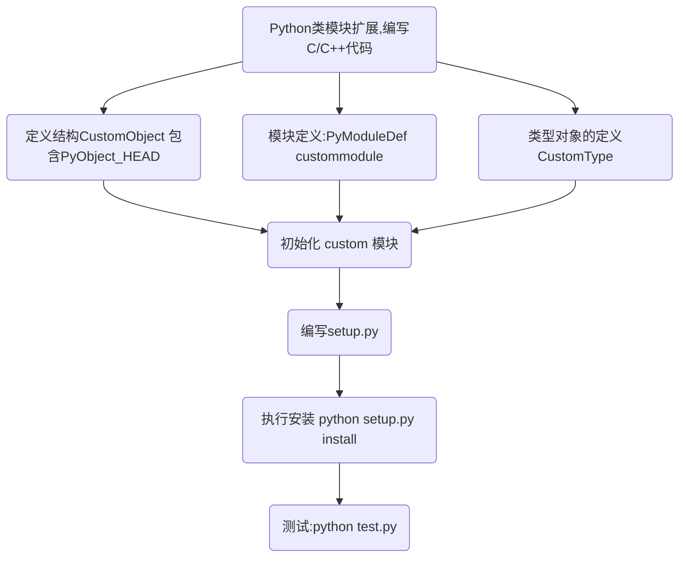
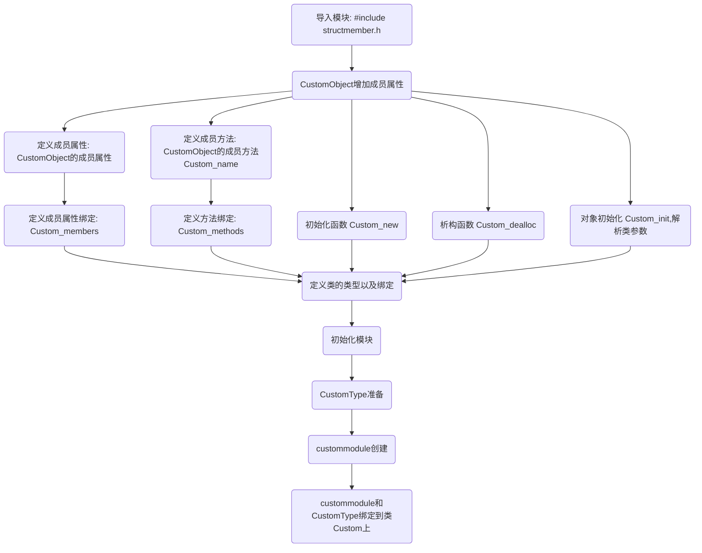

Python使用C/C++扩展类模块和之前所讲的模块差不多，多了一些流程，比如：编写类的构造函数、析构函数、成员属性、成员方法、以及成员属性和方法绑定。  

随着扩展的模块越来越复杂，不得不了解Python中的引用计数规则，更加规范的管理内存使用，防止内存泄露。

如下是两个流程，由简入繁的了解类模块开发的整个流程。

# 扩展开发流程，小试牛刀



## 编写C/C++代码
```c
// custom.cpp
#include "Python.h"

typedef struct {
    PyObject_HEAD
} CustomObject;

static PyTypeObject CustomType = {
        PyVarObject_HEAD_INIT(NULL, 0)
        .tp_name = "custom.Custom",
        .tp_doc = "Custom objects",
        .tp_basicsize = sizeof(CustomObject),
        .tp_itemsize = 0,
        .tp_flags = Py_TPFLAGS_DEFAULT,
        .tp_new = PyType_GenericNew,
};

static PyModuleDef custommodule = {
        PyModuleDef_HEAD_INIT,
        .m_name = "custom",
        .m_doc = "example module that creates an extension type.",
        .m_size = -1,
};

PyMODINIT_FUNC PyInit_custom(void)
{
    PyObject *m;
    if (PyType_Ready(&CustomType) < 0)
        return NULL;

    m = PyModule_Create(&custommodule);
    if (m == NULL)
        return NULL;

    Py_INCREF(&CustomType);
    if (PyModule_AddObject(m, "Custom", (PyObject *) &CustomType) < 0) {
        Py_DECREF(&CustomType);
        Py_DECREF(m);
        return NULL;
    }

    return m;
}
```

## 编写 setup.py 安装程序
编写 `setup.py` 之后执行`python setup.py install`，编译模块十分的方便，可以将我们的动态链接库快速导入到系统模块中，方便我们导入自己的模块。
```python
# setup.py
from distutils.core import setup, Extension
setup(name="custom", version="1.0",
      ext_modules=[Extension("custom", ["custom.cpp"])])

```

## 执行安装测试
调用模块，以及初始化对象
```
python setup.py install

>>> import custom
>>> 
>>> print(custom.Custom())
<custom.Custom object at 0x7f8552874d50>
>>> 
```

# 深入理解，成员属性成员方法注册

## 类的成员属性和方法定义及绑定流程



## 编写C/C++代码
```c
#include "Python.h"
#include "structmember.h"

typedef struct {
    PyObject_HEAD
    PyObject *first; /* first name */
    PyObject *last;  /* last name */
    int number;
} CustomObject;         // 定义新的结构体，Python中的类

// Custom_new 初始化函数
static PyObject* Custom_new(PyTypeObject *type, PyObject *args, PyObject *kwds)
{
    CustomObject *self;
    self = (CustomObject *) type->tp_alloc(type, 0);
    if (self != NULL) {
        self->first = PyUnicode_FromString("");
        if (self->first == NULL) {
            Py_DECREF(self);
            return NULL;
        }
        self->last = PyUnicode_FromString("");
        if (self->last == NULL) {
            Py_DECREF(self);
            return NULL;
        }
        self->number = 0;
    }
    return (PyObject *) self;
}

// Custom_dealloc 析构函数，释放对象
static void Custom_dealloc(CustomObject *self)
{
    Py_XDECREF(self->first);                    // 释放成员first
    Py_XDECREF(self->last);                     // 释放成员last
    Py_TYPE(self)->tp_free((PyObject *)self);   // 释放结构体 CustomObject
}

// Custom_init 对象初始化 cs = custom.Custom()
static int Custom_init(CustomObject *self, PyObject *args, PyObject *kwds)
{
    // 定义参数
    static char *kwlist[] = {"first", "last", "number", NULL};
    PyObject *first = NULL, *last = NULL, *tmp;
    // 参数绑定
    if (!PyArg_ParseTupleAndKeywords(
            args, kwds, "|OOi", kwlist, &first, &last, &self->number))
        return -1;
    // 参数赋值绑定
    if (first) {
        tmp = self->first;
        Py_INCREF(first);       // 引用计数器累加
        self->first = first;
        Py_XDECREF(tmp);
    }
    if (last) {
        tmp = self->last;
        Py_INCREF(last);        // 引用计数器累加
        self->last = last;
        Py_XDECREF(tmp);
    }
    return 0;
}

// 定义成员属性；CustomObject的成员属性
static PyMemberDef Custom_members[] = {
        {"first", T_OBJECT_EX, offsetof(CustomObject, first), 0,
                "first name"},
        {"last", T_OBJECT_EX, offsetof(CustomObject, last), 0,
                "last name"},
        {"number", T_INT, offsetof(CustomObject, number), 0,
                "custom number"},
        {NULL}  /* Sentinel */
};

// Custom_name 定义方法
static PyObject *Custom_name(CustomObject *self, PyObject *Py_UNUSED(ignored))
{
    if (self->first == NULL) {
        PyErr_SetString(PyExc_AttributeError, "first");
        return NULL;
    }
    if (self->last == NULL) {
        PyErr_SetString(PyExc_AttributeError, "last");
        return NULL;
    }
    return PyUnicode_FromFormat("%S %S", self->first, self->last);
}

// Custom_methods 定义类的方法，并绑定Custom_name
static PyMethodDef Custom_methods[] = {
        {"name", (PyCFunction) Custom_name, METH_NOARGS,
         "Return the name, combining the first and last name"
        },
        {NULL}  /* Sentinel */
};

static PyTypeObject CustomType = {
        PyVarObject_HEAD_INIT(NULL, 0)
        .tp_name = "custom.Custom",
        .tp_doc = "Custom objects",
        .tp_basicsize = sizeof(CustomObject),
        .tp_itemsize = 0,
        .tp_flags = Py_TPFLAGS_DEFAULT,
        .tp_new = PyType_GenericNew,
        .tp_init = (initproc) Custom_init,              // 绑定初始化函数，构造函数
        .tp_dealloc = (destructor) Custom_dealloc,      // 绑定析构函数
        .tp_members = Custom_members,                   // 绑定成员属性
        .tp_methods = Custom_methods,                   // 绑定成员方法
};

static PyModuleDef custommodule = {
        PyModuleDef_HEAD_INIT,
        .m_name = "custom",
        .m_doc = "example module that creates an extension type.",
        .m_size = -1,
};

// PyInit_custom 初始化模块
PyMODINIT_FUNC PyInit_custom(void)
{
    PyObject *m;
    if (PyType_Ready(&CustomType) < 0)
        return NULL;

    m = PyModule_Create(&custommodule);
    if (m == NULL)
        return NULL;

    Py_INCREF(&CustomType);
    if (PyModule_AddObject(m, "Custom", (PyObject *) &CustomType) < 0) {
        Py_DECREF(&CustomType);
        Py_DECREF(m);
        return NULL;
    }

    return m;
}
```
## 编写测试代码
`pprint` 模块可以美化我们的输出，`dir` 可以打印模块中的成员属性和成员方法，更加直观的展示输出。`['first', 'last', 'name',
 'number']` 正是我们之前在C/C++中定义的类属性、方法。
```python
import custom
from pprint import pprint

cs = custom.Custom(first="li", last="si", number=3)
pprint(dir(cs))

print(cs.name())
print(cs.first)
print(cs.number)
```
### 结果输出
```output
['__class__',
 '__delattr__',
 '__dir__',
 '__doc__',
 '__eq__',
 '__format__',
 '__ge__',
 '__getattribute__',
 '__gt__',
 '__hash__',
 '__init__',
 '__init_subclass__',
 '__le__',
 '__lt__',
 '__ne__',
 '__new__',
 '__reduce__',
 '__reduce_ex__',
 '__repr__',
 '__setattr__',
 '__sizeof__',
 '__str__',
 '__subclasshook__',
 'first',
 'last',
 'name',
 'number']
li si
li
3
```

# 总结
文章中的示例来自官方文档，官方文档比较消息的描述了开发过程，该篇增加了流程图，已经详细的注释，可以让读者更加直观的了解整个流程。

如果觉得该篇对您有所受益，还希望点赞、关注、收藏三连击，这也是我持续输出，不断提升的动力，致谢。