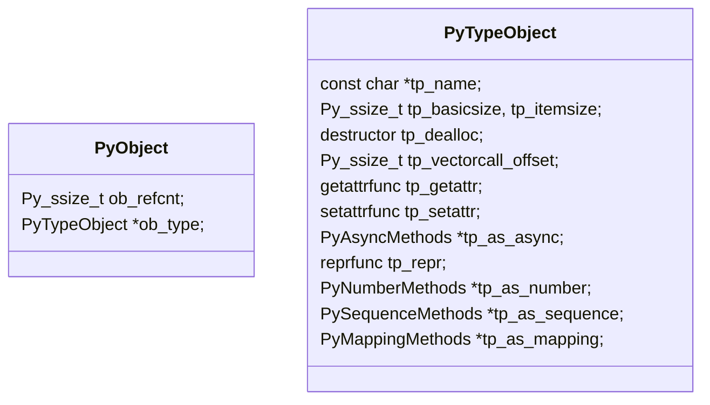

```mermaid
classDiagram
class PyObject{
    Py_ssize_t ob_refcnt;
    PyTypeObject *ob_type;
}

class PyTypeObject {
    const char *tp_name; 
    Py_ssize_t tp_basicsize, tp_itemsize;

    destructor tp_dealloc;
    Py_ssize_t tp_vectorcall_offset;
    getattrfunc tp_getattr;
    setattrfunc tp_setattr;
    PyAsyncMethods *tp_as_async;
    reprfunc tp_repr;

    PyNumberMethods *tp_as_number;
    PySequenceMethods *tp_as_sequence;
    PyMappingMethods *tp_as_mapping;
}
```