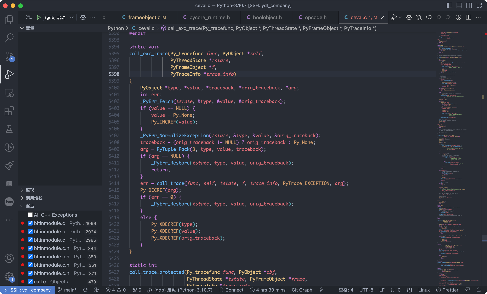

# 如何使用VS Code断点调试Python内核C/C++代码

## 下载Python源码

```bash
wget https://www.python.org/ftp/python/3.10.7/Python-3.10.7.tgz
tar -zvxf Python-3.10.7.tgz
```

## 编译Python Debug模式的程序

```bash
cd Python-3.10.7
./configure -h |grep debug
# output:
#  --with-pydebug          build with Py_DEBUG defined (default is no)
#  --with-trace-refs       enable tracing references for debugging purpose
./configure --with-pydebug --with-trace-refs

# 编译安装
make && make install
```

## 配置VS Code 运行与调试



完整配置如下，配置文件在`./.vscode/launch.json`。有两个比较重要的地方，一个是`program`，指定Python的可执行文件（你的安装路径可能和我的不一样，可以试试which python之类的命令），另一个是`args`，`args`是参数数组，可以指定Python的脚本文件，也可以指定Python的交互式命令，如`-c "print('hello world')"`。


```json
{
    // 使用 IntelliSense 了解相关属性。 
    // 悬停以查看现有属性的描述。
    // 欲了解更多信息，请访问: https://go.microsoft.com/fwlink/?linkid=830387
    "version": "0.2.0",
    "configurations": [
        {
            "name": "(gdb) 启动",
            "type": "cppdbg",
            "request": "launch",
            "program": "/usr/local/bin/python3.10d",
            "args": [
                "../test.py"
            ],
            "stopAtEntry": false,
            "cwd": "${fileDirname}",
            "environment": [],
            "externalConsole": false,
            "MIMode": "gdb",
            "setupCommands": [
                {
                    "description": "为 gdb 启用整齐打印",
                    "text": "-enable-pretty-printing",
                    "ignoreFailures": true
                },
                {
                    "description": "将反汇编风格设置为 Intel",
                    "text": "-gdb-set disassembly-flavor intel",
                    "ignoreFailures": true
                }
            ]
        }

    ]
}
```

## 调试Python内核代码

按下快捷键`F5`，开始调试。调试的时候，可以看到下图了（如果没有设置断点，可能不会停顿住）。

调试菜单有六个按钮，依次分别是：继续（F5），单步跳过，单步调试，单步跳出，重启，停止。

左侧菜单栏第一栏是变量，可以看到当前的变量值，第二栏是监视，第三栏是调用栈，可以看到当前的调用栈。第四栏是断点列表，可以添加断点，也可以删除断点。


## 为什么考虑使用断点调试的方式来学习Python的内核

1. 通过断点调试，可以看到Python内核的执行流程，可以更加直观的理解Python内核的执行流程。
2. 可以观察Python内核的变量值，了解Python变量值的数据结构，以及数据的变化。
3. 了解内核的调用栈，可以看到栈结构，以及调用栈的变化。