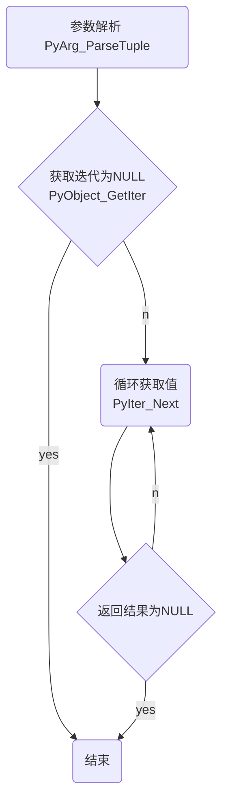

生成器和迭代器是相互依赖的，迭代器每次需要一个值，调用生成器返回一直，直到生成器返回集合所有的值。这个过程是交替执行的。

## 迭代器
迭代器是一个可以记住遍历的位置的对象。从集合的第一个元素开始遍历，直至集合所有的元素都被访问完毕。

接下来会使用 C/C++ 实现迭代器的遍历，用 C/C++ 实现一个传参为迭代器对象的函数，内部会先调用 `PyObject_GetIter` 将对象转化为一个可迭代的对象，然后循环调用 `PyIter_Next`，直至返回 NULL，在遍历的过程中调用 `PyObject_Print` 输出集合元素，并减少 `item` 的引用次数，最后通过 `Py_BuildValue` 构建一个空的返回值。



### C/C++ 实现，实现迭代器
```c
// main.cpp
#include "Python.h"
#include <stdio.h>

static PyObject *iter_print(PyObject *self, PyObject *args) {
    PyObject *iter;
    if (!PyArg_ParseTuple(args, "O", &iter)) {
        return NULL;
    }
    PyObject *item = NULL;
    PyObject *iterator = PyObject_GetIter(iter);
    if (iterator == NULL) {
        return NULL;
    }
    while ((item = PyIter_Next(iterator))) {
        PyObject_Print(item, stdout, Py_PRINT_RAW);
        printf("\n");
        Py_DECREF(item);
    }
    Py_DECREF(iterator);
    return Py_BuildValue("");
}

static PyObject *gen(PyObject *self, PyObject *args) {
    PyObject* obj = NULL;

    return obj;
}

static PyMethodDef MyDemoMethods[] = {
        {"iter_print", iter_print, METH_VARARGS, "iter print"},
        {"gen", gen, METH_VARARGS, "gen"},
        {nullptr,      nullptr, 0,               nullptr},
};

static struct PyModuleDef spammodule = {
        PyModuleDef_HEAD_INIT,
        "demo",   /* name of module */
        NULL, /* module documentation, may be NULL */
        -1,       /* size of per-interpreter state of the module,
                 or -1 if the module keeps state in global variables. */
        MyDemoMethods
};

PyMODINIT_FUNC PyInit_demo(void) {
    return PyModule_Create(&spammodule);
}
```

### 编写 setup.py 安装动态链接库，分发模块

执行 `python setup.py install` 将动态链接库生出，并拷贝至系统模块中，方便程序导入调用
```python
# setup.py
from distutils.core import setup, Extension
setup(name="demo", version="1.0",
      ext_modules=[Extension("spam", ["iter.cpp"])])
```

### 编写 Python 程序，测试结果
如下程序执行 `python test.py` 可以看到输出结果为 0 ~ 19 的整数，证明我们的程序是正确的。
```python
# test.py
import demo


def test():
    for i in range(20):
        yield i

demo.iter_print(test())
```

## 生成器
生成器是特殊的子程序，类似返回数组的函数，具备参数，可以被调用，产生一些列的值，但是所有的值不是一次性返回，每次产生一个值。

### 编写 C/C++ 代码，实现生成器
如下程序是实现一个反转列表的生成器，倒序输出列表中的值。生成器是一个类。

生成器相对于迭代器略微复杂，首先我们需要自定义一个类 `RevgenState`，与之前的 C/C++ 实现扩展类原理相似，中间多了一个环节就是实现 `next` 的调用过程 `revgen_next`。

首先程序需要判断游标是否已经遍历完所有的元素，如果遍历结束返回空 NULL。否则返回对应索引的值，并移动索引。`PySequence_GetItem` 第一个参数为列表，第二个参数为索引，帮助我们快速检索元素，程序拿到返回值返回给外部。

```c
#include "Python.h"

typedef struct {
    PyObject_HEAD
    Py_ssize_t seq_index, enum_index;
    PyObject *sequence;
} RevgenState;

static PyObject *revgen_new(PyTypeObject *type, PyObject *args, PyObject *kwargs) {
    PyObject *sequence;

    if (!PyArg_UnpackTuple(args, "revgen", 1, 1, &sequence))
        return NULL;

    if (!PySequence_Check(sequence)) {
        PyErr_SetString(PyExc_TypeError, "revgen() expects a sequence");
        return NULL;
    }

    Py_ssize_t len = PySequence_Length(sequence);
    if (len == -1)
        return NULL;

    RevgenState *rgstate = (RevgenState *) type->tp_alloc(type, 0);
    if (!rgstate)
        return NULL;

    Py_INCREF(sequence);
    rgstate->sequence = sequence;
    rgstate->seq_index = len - 1;
    rgstate->enum_index = 0;

    return (PyObject *) rgstate;
}

static void revgen_dealloc(RevgenState *rgstate) {
    Py_XDECREF(rgstate->sequence);
    Py_TYPE(rgstate)->tp_free(rgstate);
}

static PyObject *revgen_next(RevgenState *rgstate) {
    if (rgstate->seq_index >= 0) {
        PyObject *elem = PySequence_GetItem(rgstate->sequence,
                                            rgstate->seq_index);
        if (elem) {
            PyObject *result = Py_BuildValue("lO", rgstate->enum_index, elem);
            rgstate->seq_index--;
            rgstate->enum_index++;
            return result;
        }
    }

    rgstate->seq_index = -1;
    Py_CLEAR(rgstate->sequence);
    return NULL;
}


PyTypeObject PyRevgen_Type = {
        PyVarObject_HEAD_INIT(&PyType_Type, 0)
        "revgen",                       /* tp_name */
        sizeof(RevgenState),            /* tp_basicsize */
        0,                              /* tp_itemsize */
        (destructor) revgen_dealloc,     /* tp_dealloc */
        0,                              /* tp_print */
        0,                              /* tp_getattr */
        0,                              /* tp_setattr */
        0,                              /* tp_reserved */
        0,                              /* tp_repr */
        0,                              /* tp_as_number */
        0,                              /* tp_as_sequence */
        0,                              /* tp_as_mapping */
        0,                              /* tp_hash */
        0,                              /* tp_call */
        0,                              /* tp_str */
        0,                              /* tp_getattro */
        0,                              /* tp_setattro */
        0,                              /* tp_as_buffer */
        Py_TPFLAGS_DEFAULT,             /* tp_flags */
        0,                              /* tp_doc */
        0,                              /* tp_traverse */
        0,                              /* tp_clear */
        0,                              /* tp_richcompare */
        0,                              /* tp_weaklistoffset */
        PyObject_SelfIter,              /* tp_iter */
        (iternextfunc) revgen_next,      /* tp_iternext */
        0,                              /* tp_methods */
        0,                              /* tp_members */
        0,                              /* tp_getset */
        0,                              /* tp_base */
        0,                              /* tp_dict */
        0,                              /* tp_descr_get */
        0,                              /* tp_descr_set */
        0,                              /* tp_dictoffset */
        0,                              /* tp_init */
        PyType_GenericAlloc,            /* tp_alloc */
        revgen_new,                     /* tp_new */
};


static struct PyModuleDef spammodule = {
        PyModuleDef_HEAD_INIT,
        "spam",                  /* m_name */
        "",                      /* m_doc */
        -1,                      /* m_size */
};


PyMODINIT_FUNC
PyInit_spam(void) {
    PyObject *module = PyModule_Create(&spammodule);
    if (!module)
        return NULL;

    if (PyType_Ready(&PyRevgen_Type) < 0)
        return NULL;
    Py_INCREF((PyObject *) &PyRevgen_Type);
    PyModule_AddObject(module, "revgen", (PyObject *) &PyRevgen_Type);

    return module;
}
```

### 编写测试程序，测试生成器和迭代器

执行如下程序`python test.py`，输出结果依次为`(0, 'c')`, `(1, 'b')`, `(2, 'a')`。从结果来看已经达到了此次实验的目的。

```python
# test.py
import demo
import spam

demo.iter_print(spam.revgen(['a', 'b', 'c']))
```

## 总结

从以上实验的过程和结果来看，C/C++ 实现生成器和迭代器并没有想象的那么复杂，套用模板即可。了解 C/C++ 开发 Python 扩展的整个流程之后，照搬模板就显得游刃有余了，简单点的参数调试和测试也十分的简单。

迭代器和生成器的出现可以避免一次性将数据加载到内存中，减少内存分配，腾出更多的内存空间给其他的模块。