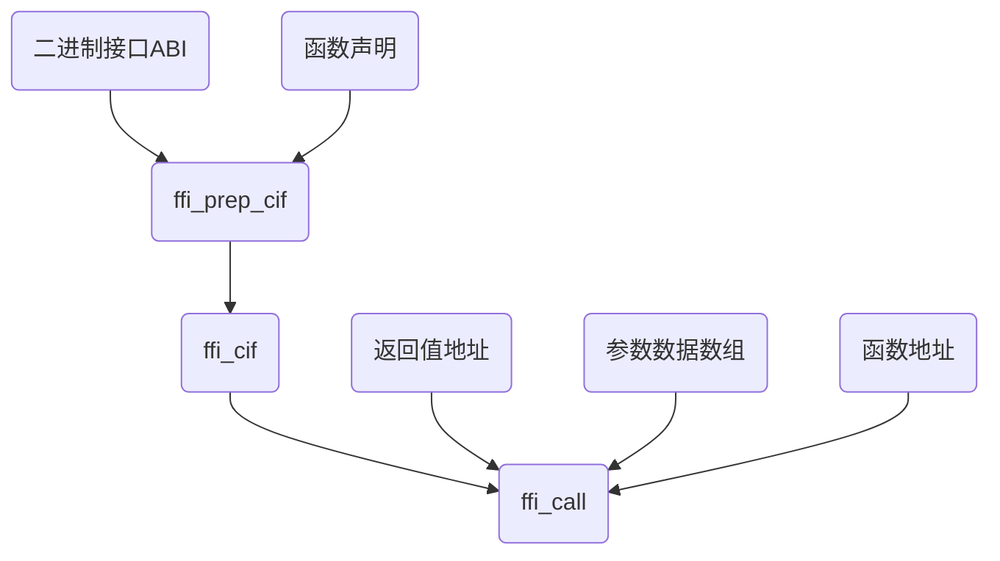

# Python 通过 FFI 调用 C/C++ 代码


# 动态链接库调用

确定函数声明和 ABI（二进制接口），就能够确定参数和返回值的传递方式。  

FFI 的传递方式是基于函数声明和 ABI 的固定不变的东西，再加上能够变化的 函数地址、数据，就可以调用这个函数。



## 编写 C 语言接口
```c
// ffi_test.cpp
extern "C" int add(int a, int b);

int add(int a, int b) {
    return a + b;
}
```

## 编写 Python 程序调用动态链接库
```python
# test_ffi.py
from cffi import FFI

ffi = FFI()
ffi.cdef("""
  int add(int a, int b);
""")

lib = ffi.dlopen("libffi_test.so")
print(lib.add(3, 4))
```

## 代码编译及执行
```bash
g++ ffi_test.cpp -fPIC -shared -o libffi_test.so

python test_ffi.py

# output: 7
```

# Python 代码中嵌入 C 代码
```python
from cffi import FFI

ffi = FFI()
ffi.cdef("""
  int add(int a, int b);
""")

lib = ffi.verify("""
  int add(int a,int b){
    return a+b;
  }
""")
print(lib.add(3, 4))
```

# 总结

通过 FFI 我们可以轻松的在 Python 中嵌入 C/C++ 语言代码，从而避免在 C/C++ 繁琐的编译工具链耗费大量的时间，减少开发成本。  

调用动态链接库，方便我们跨语言复用代码库，不需要在当前语言的基础上再实现一次。  

FFI 支持 CPython、Ruby、Rust、Nodejs、PHP、Java 等，支持大部分的系统架构和操作系统，X86、X86-64、PowerPC、ARM、AArch64 等。