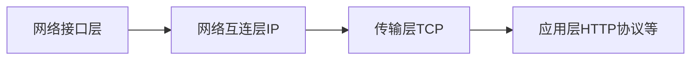
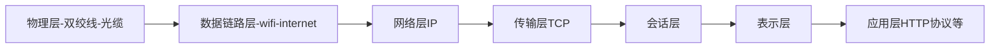

## TCP/IP 协议栈

## 位码即 tcp 标志位，有 6 种标示：
- SYN(synchronous 建立联机) 
- ACK(acknowledgement 确认)
- PSH(push 传送) 
- FIN(finish 结束) 
- RST(reset 重置) 
- URG(urgent 紧急)

- Sequence number(顺序号码) 
- Acknowledge number(确认号码)


### Wireshark 过滤条件
```
ip.dst == 42.192.78.57 or ip.src == 42.192.78.57

ip.dst==10.0.2.25 or ip.addr==10.0.2.25 
```

### Wireshark


### TCP/IP 分层
#### 四层



#### OSI 七层协议

