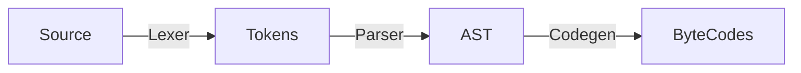
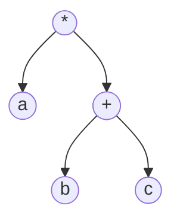

# 自己动手实现Lua

## 准备
- 准备开发环境
  - IDE vscode 安装c/c++插件，go相关开发的插件
- 了解Lua源码的目录结构，相关文件存在的意义
- 改变自己的默认看法，学习一门语言不是为了学习新的语法糖，而是学习它的设计思想。每种语言发展至今都有其存在的意义，如果没有什么特色，学一门语言和多门语言有什么区别呢？

## Lua虚拟机和Lua API

### 二进制chunk

### 指令集

### Lua API

### Lua运算符

### 虚拟机雏形

### 表

### 函数调用

### Go函数调用

### 闭包和Upvalue

### 元编程

### 迭代器

## Lua语法和编译器

### 词法分析

词法分析器的作用是根据编程语言的词法规则，把源代码（字符流）分解为token流。
token按其作用可以分为不同的类型，比较常见的类型：
- 空白字符
  - \r、\n、\t、\v、\f、\s
- 注释
  - 短注释、长注释
- 关键字
  - and、break、do、else、if、elseif、end、false、for、fuction、goto、in、nil、local、not、or、repeat、return、then、true、until、while
- 标识符
  - Identifier 变量命名
- 字面量
  - 数字字面变量，整数、浮点
  - 字符串字面量
- 运算符
  - +、-、*、/、^、~、%、&、|、>>、<<等
- 分隔符
  - (、)、[、]、{、}、,、:、;等

### 抽象语法树AST

语法规则定义了怎样的组合可以构成合法的程序。`词法分析阶段`根据`词法规则`将字符序列分解为token序列，`语法分析阶段`根据`语法规则`将token序列解析为抽象语法树（AST）。  

例如： a * (b + c)

### 语法分析

### 代码生成

## Lua标准库

### 辅助API和基础库

### 工具库

### 包和模块

### 协程

# 总结